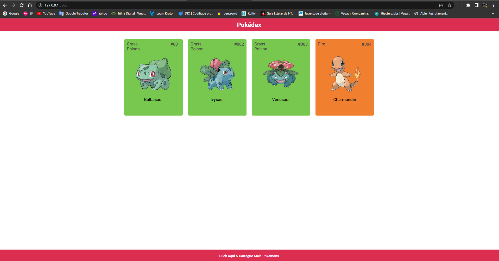
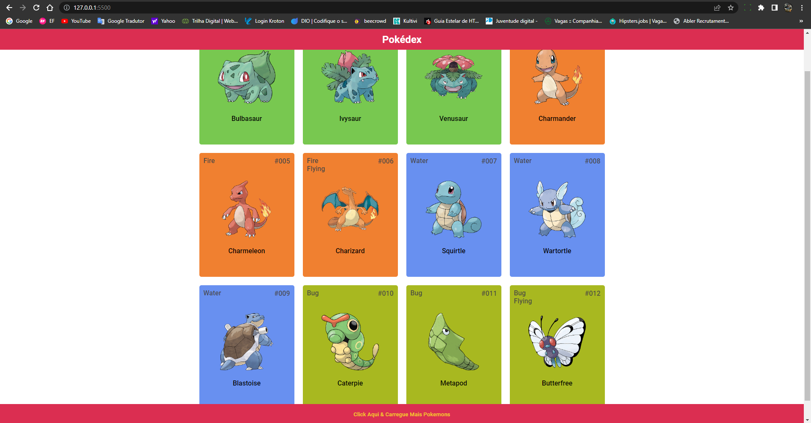
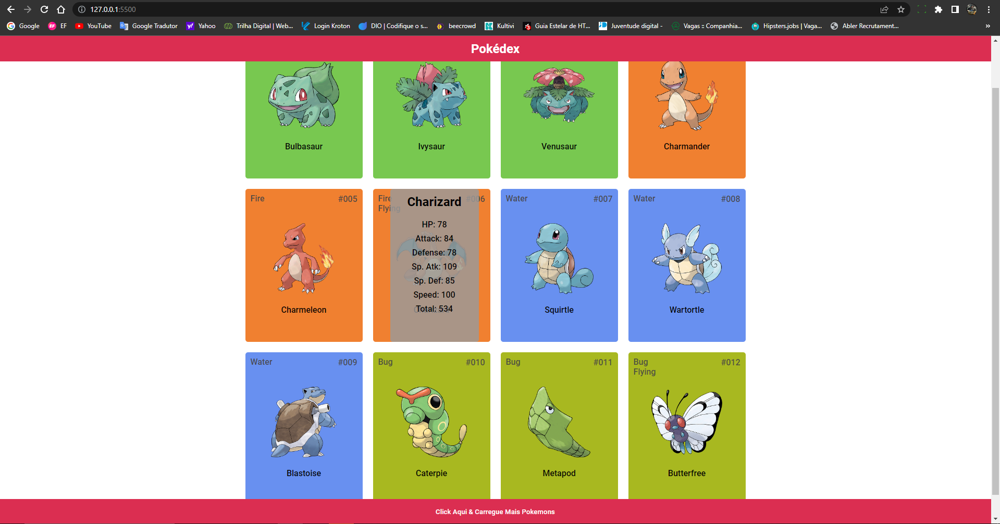

# challenges-api

# 0º Trabalhando com pesquisa dentro de API em React.

<h4>Lista de pesquisa dentro do API: https://jsonplaceholder.typicode.com/todos</h4>

# 1º Uso de dados da Pokedex-API.

<h4>Uso prático de API, usando Pokedex: https://pokeapi.co/api/v2/</h4>

